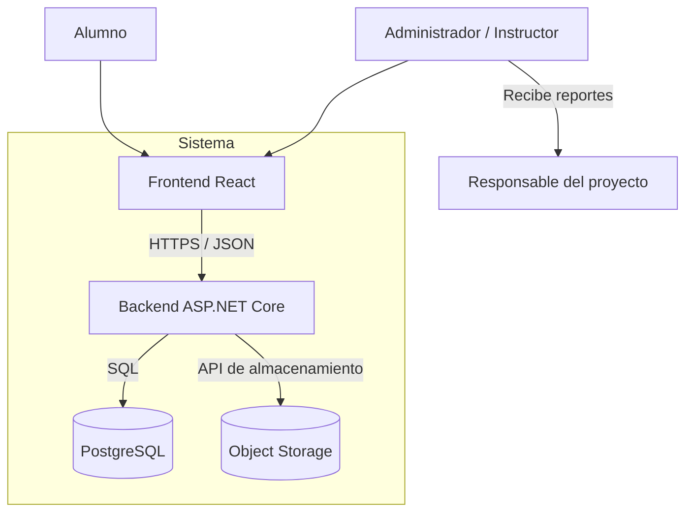
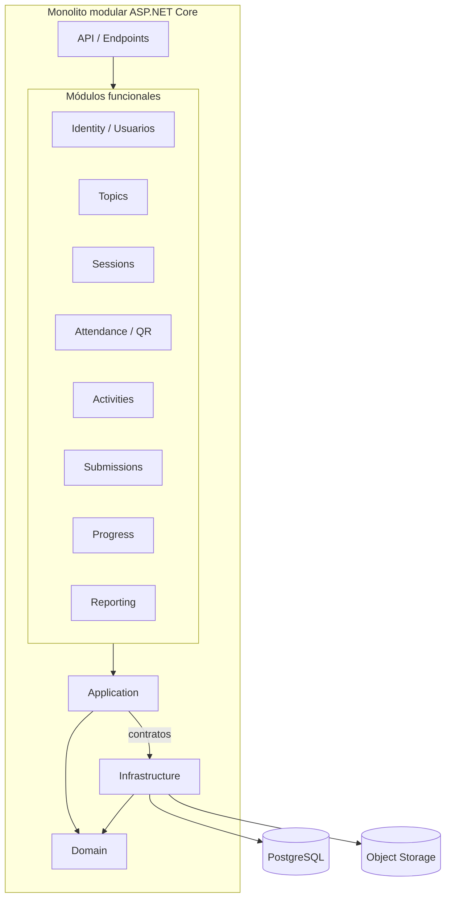
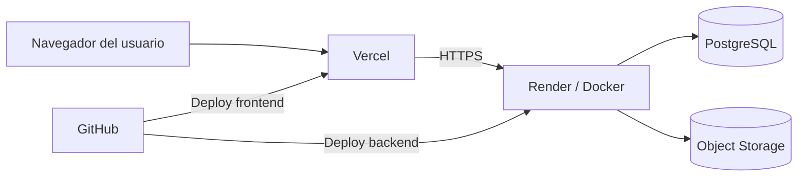
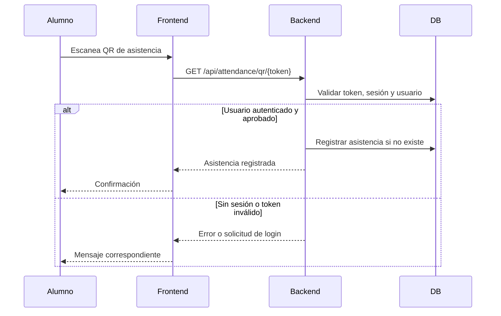
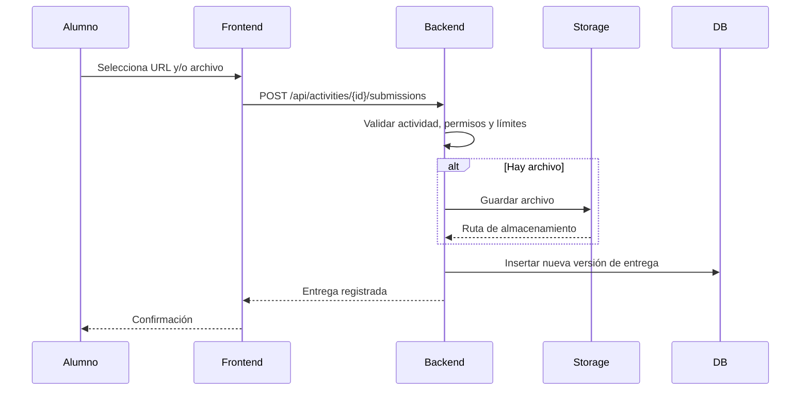
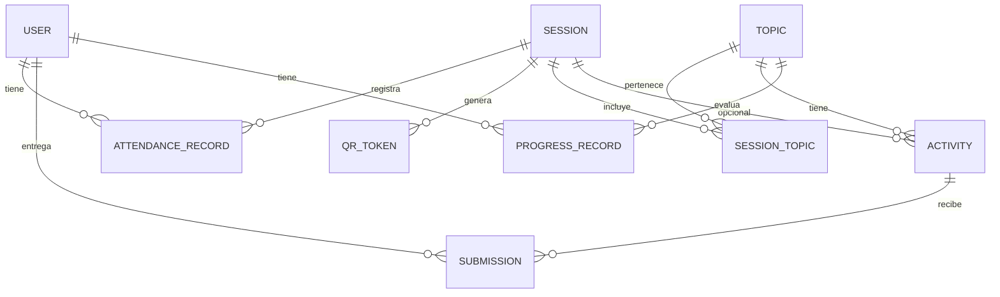
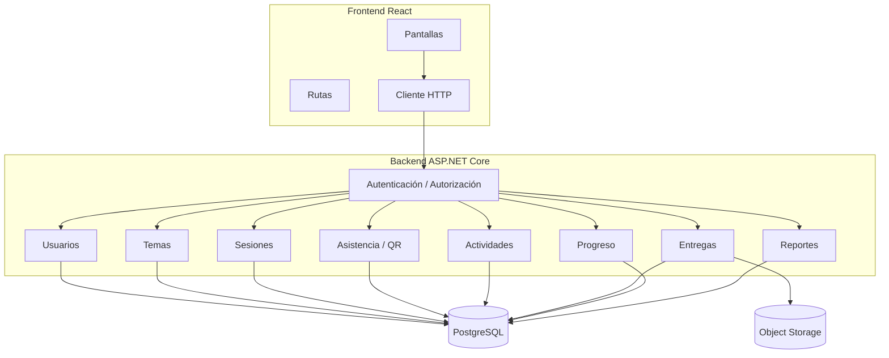

# Arquitectura del sistema

## 1. Objetivo de la arquitectura

Definir la estructura técnica del sistema que gestionará:

- Registro y aprobación de alumnos.
- Temas del taller.
- Sesiones impartidas.
- Asistencia manual y mediante QR.
- Actividades con descripción en Markdown.
- Entregas de alumnos con URL y/o archivos.
- Historial de reentregas.
- Progreso por tema.
- Reportes oficiales de asistencia y progreso.

La arquitectura busca ser simple de implementar y mantener durante el semestre del taller, evitando sobreingeniería.

---

## 2. Decisiones arquitectónicas

| ID | Decisión | Justificación |
|---|---|---|
| A-01 | Monolito modular | El alcance del taller no requiere microservicios. Facilita desarrollo, despliegue y depuración. |
| A-02 | CQRS ligero | Permite separar comandos y consultas sin llegar a una arquitectura excesivamente compleja. |
| A-03 | Backend en ASP.NET Core | Se alinea con el conocimiento del equipo y permite usar EF Core, Docker y autenticación robusta. |
| A-04 | EF Core con PostgreSQL | Facilita migraciones, modelo de datos y acceso a base de datos. |
| A-05 | Archivos fuera de la base de datos | Cumple RN-05. Los archivos se guardan en Object Storage y en la base de datos solo se conserva metadata. |
| A-06 | Frontend SPA en React | Permite una interfaz dinámica para alumnos e instructor, desplegable como sitio estático. |
| A-07 | Reportes exportables | Los reportes PDF/CSV son la evidencia principal del proyecto. |
| A-08 | Registro con aprobación administrativa | Cumple D-01. Las cuentas nuevas quedan pendientes hasta aprobación. |
| A-09 | QR con autenticación | Cumple D-04. El alumno debe estar autenticado y aprobado para registrar asistencia por QR. |
| A-10 | Entregas versionadas | Cumple D-03. Cada reentrega crea una nueva versión sin eliminar el historial. |

---

## 3. Vista general del sistema



### Descripción

- El alumno y el administrador usan el frontend web.
- El frontend se comunica con el backend mediante HTTPS.
- El backend persiste datos en PostgreSQL.
- Los archivos entregados se guardan en Object Storage.
- El responsable del proyecto puede recibir reportes exportados sin necesitar cuenta en el sistema.

---

## 4. Estilo arquitectónico

El sistema será un **monolito modular** con separación interna por capas y módulos.



---

## 5. Capas del backend

### 5.1 Domain

Contiene entidades, enums, value objects y reglas de negocio.

Responsabilidades:

- Definir entidades como `User`, `Session`, `Activity`, `Submission`, `AttendanceRecord`, `ProgressRecord`.
- Contener reglas de negocio puras.
- No depender de base de datos, HTTP ni librerías externas de infraestructura.

Ejemplos:

```text
User
Topic
Session
AttendanceRecord
Activity
Submission
ProgressRecord
QrToken
```

### 5.2 Application

Contiene casos de uso, comandos, consultas y DTOs.

Responsabilidades:

- Orquestar reglas de negocio.
- Definir contratos de repositorios y servicios.
- Validar entradas de caso de uso.
- Separar comandos y consultas.

Ejemplos de comandos:

```text
RegisterStudent
ApproveUser
RejectUser
CreateTopic
CreateSession
GenerateQrToken
RegisterAttendanceByQr
RegisterManualAttendance
CreateActivity
PublishActivity
SubmitActivity
ReviewSubmission
AdjustProgressManually
```

Ejemplos de consultas:

```text
GetUsers
GetPendingRegistrations
GetTopics
GetSessions
GetAttendanceBySession
GetActivityById
GetSubmissionHistory
GetStudentProgress
GetAttendanceReport
GetProgressReport
```

### 5.3 Infrastructure

Implementa detalles técnicos.

Responsabilidades:

- Acceso a base de datos con EF Core.
- Acceso a Object Storage.
- Generación de QR.
- Generación de reportes PDF/CSV.
- Hashing de contraseñas.
- Tokens de autenticación.
- Logs y servicios externos.

Componentes sugeridos:

```text
TallerDbContext
UserRepository
SessionRepository
ActivityRepository
SubmissionRepository
AttendanceRepository
ProgressRepository
FileStorageService
QrGeneratorService
ReportGeneratorService
```

### 5.4 API

Expone los endpoints HTTP.

Responsabilidades:

- Autenticación.
- Autorización por rol.
- Validación de requests.
- Inyección de dependencias.
- Exposición de endpoints REST.
- Manejo global de errores.

---

## 6. Módulos funcionales

| Módulo | Responsabilidad | Requisitos relacionados |
|---|---|---|
| Identity / Usuarios | Registro, login, aprobación, roles y gestión básica de usuarios | RF-01, RF-02, RF-03, RF-04, D-01, D-02 |
| Topics | Gestión de temas oficiales del taller | RF-05 |
| Sessions | Registro de sesiones impartidas | RF-06 |
| Attendance | Asistencia manual, QR y contingencias | RF-07 a RF-11, D-04 |
| Activities | Creación y edición de actividades con Markdown | RF-12, RF-13, RF-14 |
| Submissions | Entregas, archivos, URL, versiones y estados | RF-15 a RF-18, D-03 |
| Progress | Cálculo y ajuste manual del progreso por tema | RF-19, RF-20, D-05 |
| Reporting | Generación y exportación de reportes oficiales | RF-21, RF-22, RF-23, RN-08 |
| Audit | Registro de fechas y usuarios de creación/actualización | RF-24 |

---

## 7. Diagrama de despliegue propuesto



### Descripción

- **Frontend:** React + Vite desplegado en Vercel o similar.
- **Backend:** ASP.NET Core desplegado como contenedor Docker en Render o similar.
- **Base de datos:** PostgreSQL administrado, por ejemplo Supabase o Neon.
- **Archivos:** Object Storage, por ejemplo Supabase Storage o Cloudflare R2.
- **GitHub:** Repositorio fuente y disparador de despliegues.

---

## 8. Diagrama de flujo: registro de asistencia con QR

Este flujo considera la decisión D-04: el alumno debe estar autenticado y aprobado.



### Consideraciones

- El QR apunta a una URL con token único.
- El token debe estar asociado a una sesión.
- El token puede expirar.
- El alumno debe iniciar sesión antes de registrar asistencia.
- Si no hay internet, se usa registro manual del instructor, según RF-11.

---

## 9. Diagrama de flujo: entrega de actividad

Este flujo considera entregas con URL, archivo o ambos, según la configuración de la actividad.



### Consideraciones

- Cada entrega genera una nueva versión.
- Las versiones anteriores no se eliminan.
- La última versión es la vigente.
- El archivo no se guarda en base de datos.
- Se validan tamaño máximo y extensiones permitidas.

---

## 10. Modelo de datos de alto nivel



---

## 11. Entidades principales

| Entidad | Responsabilidad |
|---|---|
| `User` | Alumnos, administradores e instructores. |
| `Topic` | Temas oficiales del taller. |
| `Session` | Sesiones del taller. |
| `SessionTopic` | Relación entre sesiones y temas. |
| `AttendanceRecord` | Registro de asistencia por alumno y sesión. |
| `QrToken` | Token asociado a una sesión para registro por QR. |
| `Activity` | Actividades creadas por el instructor. |
| `Submission` | Entregas de alumnos, versionadas. |
| `ProgressRecord` | Progreso de un alumno por tema. |

---

## 12. Reglas de persistencia importantes

### 12.1 Número de control

De acuerdo con RN-01 y RN-02:

- `ControlNumber` se guarda como texto.
- Es obligatorio.
- Se deben eliminar espacios al inicio y al final antes de validar.
- Debe ser único.
- No se validará el formato institucional cancelado.

Recomendación:

```text
Índice único en Users.ControlNumber
```

### 12.2 Asistencia única por sesión

De acuerdo con RN-04:

```text
Único compuesto: AttendanceRecord(SessionId, UserId)
```

Esto evita registros duplicados.

### 12.3 Entregas versionadas

De acuerdo con D-03:

```text
Único sugerido: Submission(ActivityId, UserId, VersionNumber)
```

Cada reentrega crea una nueva versión.

### 12.4 Progreso único por alumno y tema

```text
Único sugerido: ProgressRecord(UserId, TopicId)
```

El estado puede ser automático o manual.

### 12.5 QR único

```text
Único sugerido: QrToken(Token)
```

Cada token debe estar asociado a una sesión.

### 12.6 Sesión-tema

```text
Único sugerido: SessionTopic(SessionId, TopicId)
```

Esto evita asociar el mismo tema varias veces a la misma sesión.

### 12.7 Tiempo canónico en UTC

De acuerdo con RN-09:

- `DateTimeOffset` en C# y `timestamptz` en PostgreSQL para `CreatedAt`, `UpdatedAt`, `SessionDate`, `DueDate`, `SubmittedAt`, `ReviewedAt` y expiración de QR.
- El backend compara en UTC (`DateTimeOffset.UtcNow` vía `TimeProvider` inyectable).
- La API serializa ISO-8601 con desplazamiento; el frontend lo muestra en la hora local del usuario.

---

## 13. Estructura del backend (estado actual vs evolución futura)

Estado actual (canónico):

```text
Backend/
├── Backend.csproj      # Proyecto único, API con Controllers
├── Program.cs
├── Controllers/
├── Properties/
└── Dockerfile          # Generado por VS, sin docker-compose.yml ni /health aún
```

Dependencias ya instaladas pero sin uso: `MediatR`, `FluentValidation`, `EF Core`, `Npgsql.EntityFrameworkCore.PostgreSQL`, `xunit.v3`. Aún no hay `DbContext`, `Application/Features/` ni tests reales. El frontend React + Vite + Tailwind está pendiente y se construirá después del backend.

Evolución futura (cuando haya casos de uso reales), no implementar por adelantado:

```text
backend/
├── src/
│   ├── Api/
│   ├── Application/
│   ├── Domain/
│   └── Infrastructure/
├── tests/
├── Dockerfile
└── docker-compose.yml
```

La propuesta detallada en `arquitectura-y-datos.md` (`src/Domain, Application, Infrastructure, API`) se mantiene como referencia para esa evolución futura.

---

## 14. Endpoints sugeridos

Estos endpoints son una propuesta inicial. Pueden ajustarse durante la implementación.

### 14.1 Autenticación y usuarios

```text
POST   /api/auth/register
POST   /api/auth/login
GET    /api/users/me

GET    /api/admin/users
GET    /api/admin/users/pending
POST   /api/admin/users/{id}/approve
POST   /api/admin/users/{id}/reject
POST   /api/admin/users/{id}/activate
POST   /api/admin/users/{id}/deactivate
POST   /api/admin/users/{id}/reset-password
```

### 14.2 Temas

```text
GET    /api/topics
POST   /api/topics
PATCH  /api/topics/{id}
POST   /api/topics/{id}/deactivate
```

### 14.3 Sesiones

```text
GET    /api/sessions
POST   /api/sessions
PATCH  /api/sessions/{id}
POST   /api/sessions/{id}/mark-imparted
POST   /api/sessions/{id}/cancel
```

### 14.4 Asistencia

```text
GET    /api/sessions/{id}/attendance
POST   /api/sessions/{id}/attendance/manual
GET    /api/sessions/{id}/qr
POST   /api/sessions/{id}/qr/regenerate
POST   /api/attendance/qr/{token}
```

### 14.5 Actividades

```text
GET    /api/activities
GET    /api/activities/{id}
POST   /api/activities
PATCH  /api/activities/{id}
POST   /api/activities/{id}/publish
POST   /api/activities/{id}/close
```

### 14.6 Entregas

```text
GET    /api/activities/{id}/submissions/me
POST   /api/activities/{id}/submissions
GET    /api/admin/activities/{id}/submissions
PATCH  /api/admin/submissions/{id}/status
```

### 14.7 Progreso

```text
GET    /api/progress/me
GET    /api/admin/progress
POST   /api/admin/progress/{userId}/{topicId}/adjust
DELETE /api/admin/progress/{userId}/{topicId}/adjust
```

### 14.8 Reportes

```text
GET    /api/reports/attendance?format=pdf
GET    /api/reports/attendance?format=csv
GET    /api/reports/progress?format=pdf
GET    /api/reports/progress?format=csv
```

---

## 15. Diagrama de componentes por módulo



---

## 16. Seguridad transversal

El sistema debe considerar:

- Contraseñas con hash seguro.
- Roles: `Administrador` y `Estudiante`.
- Cuentas de alumnos pendientes hasta aprobación.
- Autorización por endpoint.
- Validación de dominio de correo configurable.
- Validación de entradas en backend.
- Sanitización de Markdown para evitar XSS.
- Validación de archivos subidos.
- Archivos almacenados fuera de la base de datos.
- Uso de variables de entorno para secretos.
- Tokens únicos y expirables para QR.

---

## 17. Configuración por variables de entorno

Ejemplos de variables sugeridas:

```text
ConnectionStrings__DefaultConnection
AllowedEmailDomain
JwtSecret
StorageProvider
StorageEndpoint
StorageAccessKey
StorageSecretKey
StorageBucket
FrontendUrl
FileMaxSizeInMb
QrExpirationMinutes
```

Importante:

- Ningún secreto debe subirse a GitHub.
- Se recomienda tener archivos `.env.example` sin valores reales.

---

## 18. Docker

El backend debe poder ejecutarse en un contenedor Docker.

El contenedor debe:

- Compilar la aplicación ASP.NET Core.
- Exponer el puerto HTTP configurado.
- Leer configuración desde variables de entorno.
- Incluir endpoint de salud.

Endpoint de salud sugerido:

```text
GET /health
```

Para desarrollo local, se puede usar `docker-compose.yml` con:

```text
api
database
```

En producción, la base de datos y el storage pueden ser servicios administrados.

---

## 19. Reportes

El módulo de reportes debe generar documentos con el encabezado oficial
(valores configurables por despliegue en la sección `Reports`, nunca fijos
en el repositorio):

```text
Proyecto: <nombre del proyecto>
Periodo: <periodo>
Responsable: <responsable del proyecto>
Estudiante asesor: <estudiante asesor>
```

### Reporte de asistencia

Debe incluir:

- Lista de alumnos.
- Número de control.
- Sesiones.
- Estados de asistencia.
- Porcentaje de asistencia.

### Reporte de progreso

Debe incluir:

- Lista de alumnos.
- Número de control.
- Estado por cada tema.
- Progreso general opcional.

Estos reportes cumplen con la evidencia solicitada:

> Lista de asistencia y tabla de progreso de los temas.

---

## 20. Restricciones y supuestos actuales

- El dominio de correo permitido está pendiente de definir.
- El número de control no valida formato institucional en esta versión.
- El administrador restablece contraseñas manualmente por ahora.
- El sistema no requiere app móvil nativa.
- No se requiere integración automática con jueces de programación competitiva en la primera versión.
- Los archivos se suben a storage externo, no a la base de datos.
